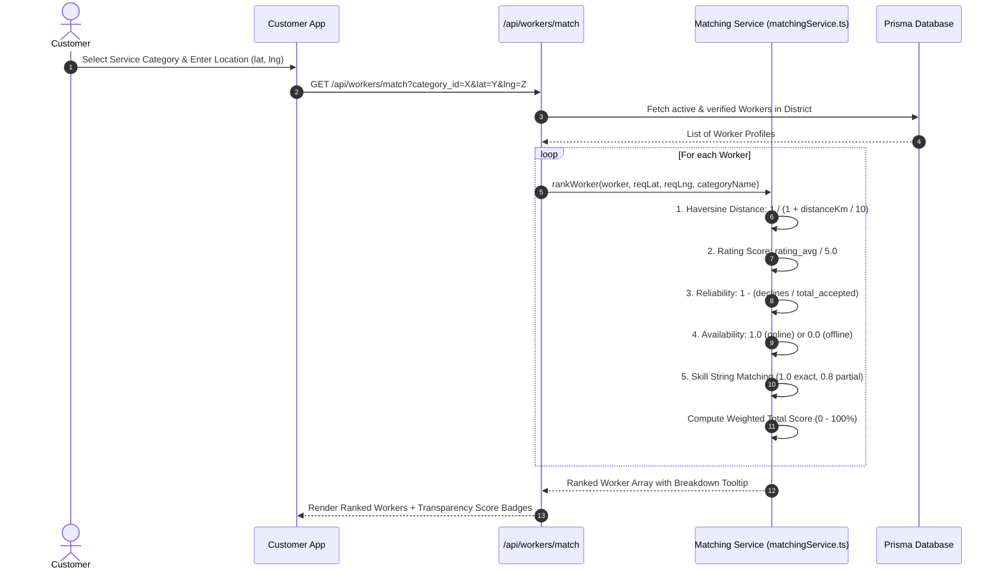
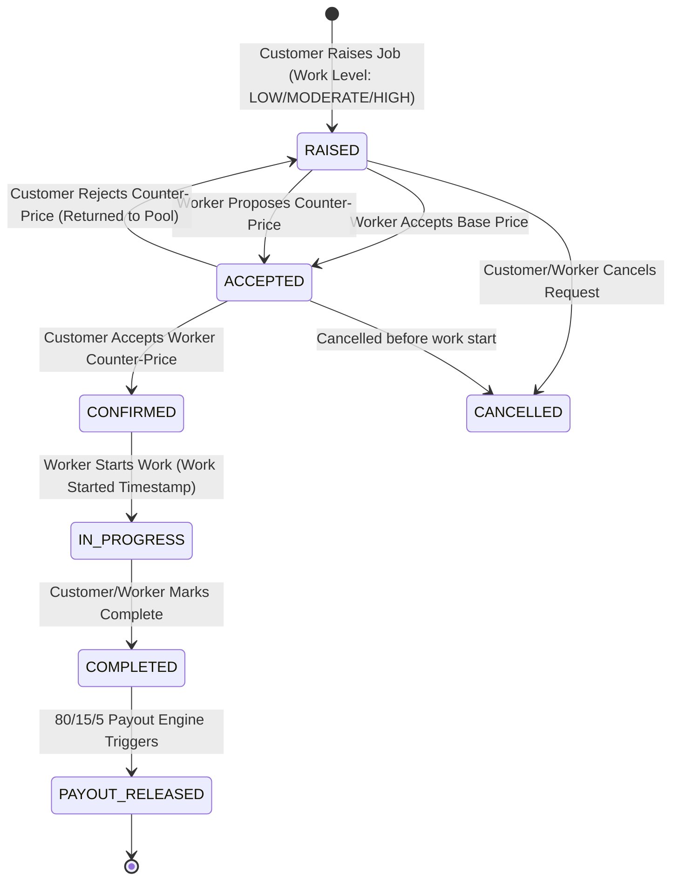
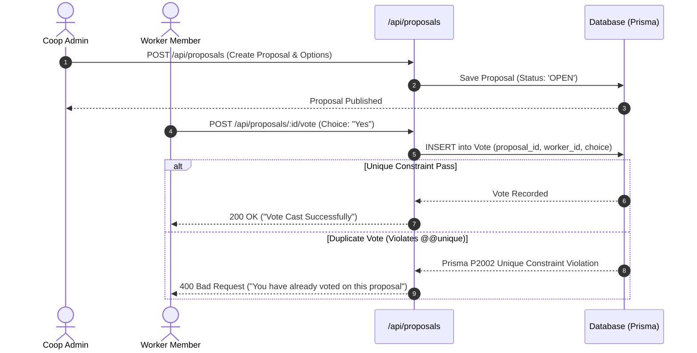
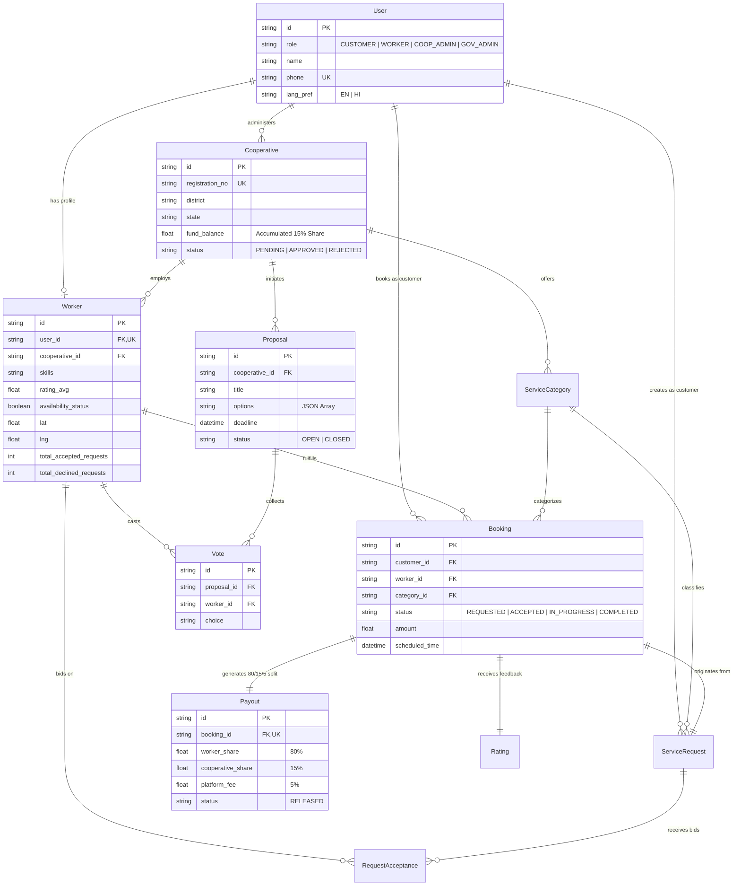

# SahakarConnect - Technical Architecture & System Blueprint

**Smart India Hackathon 2026 (Problem Statement 26089)**  
**Sponsored by:** Ministry of Cooperation, Government of India  
**Project Title:** Cooperative Gig Services Platform for Household & Community Services  

---

## Executive Summary & Solution Paradigm

Commercial gig aggregators extract **20% to 30% commission** from every transaction while denying workers equity, democratic voice, or welfare security. 

**SahakarConnect** fundamentally transforms gig work by organizing workers into **Democratic Worker Cooperatives**. The platform enforces an **automated, immutable fee distribution** on every completed service booking:

$$\text{Total Service Fee} = 80\% \text{ Worker Direct Share} + 15\% \text{ Cooperative Welfare Fund} + 5\% \text{ Tech Maintenance Fee}$$

```
                          Total Booking Revenue
                                    │
         ┌──────────────────────────┼──────────────────────────┐
         │ 80%                      │ 15%                      │ 5%
         ▼                          ▼                          ▼
┌──────────────────┐      ┌──────────────────┐      ┌──────────────────┐
│  Worker Payout   │      │ Cooperative Fund │      │ Platform Tech Fee│
│  (Direct Bank /  │      │ (Health, Safety  │      │ (Cloud Infra &   │
│  UPI Account)    │      │ Net & Training)  │      │ Tech Maintenance)│
└──────────────────┘      └──────────────────┘      └──────────────────┘
```

---

## 1. High-Level System Architecture Diagram

```mermaid
flowchart TB
    subgraph Layer1["1. CLIENT PRESENTATION TIER (React 18 + Vite + Tailwind)"]
        direction LR
        CP["🛒 Customer Portal\n(Discovery, Request, Tracking, Feedback)"]
        WP["🛠️ Worker Member Portal\n(Live Job Bids, Counter-Proposals, Earnings, Voting)"]
        AP["🏛️ Cooperative Admin Portal\n(Worker KYC, 15% Fund Ledger, Poll Creation)"]
        GP["🇮🇳 Platform Admin Portal\n(National Registry, GMV & Payout Analytics)"]
    end

    subgraph Layer2["2. API GATEWAY & REALTIME EVENT BUS (Node.js + Express)"]
        direction TB
        JWT["🔐 Auth Guard & Role RBAC\n(Phone Auth + Dev OTP 123456)"]
        REST["🛣️ REST API Controller Router\n(/api/requests, /api/bookings, /api/cooperatives)"]
        SOCKET["⚡ Socket.io Real-Time Bus\n(emitNewServiceRequest, emitRequestAccepted, emitRequestConfirmed)"]
    end

    subgraph Layer3["3. BUSINESS LOGIC & ALGORITHMIC ENGINES"]
        direction TB
        PE["💰 80/15/5 Payout Engine\n(payoutService.ts)\nAtomic Transaction Split"]
        ME["🧠 Transparent AI Matching Engine\n(matchingService.ts)\nHaversine Distance & Weighted Rank"]
        SE["🔄 Service Request Bidding Machine\n(requestRoutes.ts)\nCounter-Price & Dynamic Multipliers"]
        GE["🗳️ 1-Member-1-Vote Engine\n(governanceRoutes.ts)\nUnique Vote Constraint Validation"]
    end

    subgraph Layer4["4. PERSISTENCE & DATA LAYER (Prisma ORM)"]
        direction LR
        DB_U[("User")]
        DB_C[("Cooperative")]
        DB_W[("Worker")]
        DB_B[("Booking")]
        DB_SR[("ServiceRequest")]
        DB_P[("Payout")]
        DB_V[("Proposal & Vote")]
    end

    subgraph Layer5["5. INFRASTRUCTURE & DEVOPS"]
        direction LR
        DOCKER["📦 Docker Containers\n(docker-compose.yml)"]
        PG["🗄️ PostgreSQL / SQLite DB"]
        NGINX["🌐 Nginx Static Web Server"]
    end

    CP & WP & AP & GP <-->|HTTP REST & WebSockets| JWT & REST & SOCKET
    JWT & REST & SOCKET --> PE & ME & SE & GE
    PE & ME & SE & GE <-->|Type-Safe Prisma Queries| DB_U & DB_C & DB_W & DB_B & DB_SR & DB_P & DB_V
    Layer4 <--> Layer5
```




---

## 2. Dynamic Workflow Sequence Diagrams

### A. 80/15/5 Financial Payout Flow (`payoutService.ts`)

Upon transitioning a booking state to `COMPLETED`, an atomic Prisma database transaction calculates and distributes funds without human intervention:

```mermaid
sequenceDiagram
    autonumber
    actor Customer
    actor Worker
    participant API as Express API (/api/requests)
    participant PayoutEngine as Payout Engine (payoutService.ts)
    participant DB as Database (Prisma $transaction)
    participant Socket as Socket.io WebSockets

    Customer->>API: POST /api/requests/:id/complete
    API->>PayoutEngine: processBookingPayout(bookingId)
    PayoutEngine->>PayoutEngine: Calculate 80% Worker Share, 15% Coop Share, 5% Platform Fee
    
    rect rgb(20, 30, 50)
        Note over PayoutEngine,DB: Atomic Database Transaction
        PayoutEngine->>DB: 1. Create Payout Record (status: 'RELEASED')
        PayoutEngine->>DB: 2. Increment Cooperative.fund_balance (+15%)
        PayoutEngine->>DB: 3. Update Booking.status = 'COMPLETED'
    end

    DB-->>PayoutEngine: Transaction Success
    PayoutEngine-->>API: Payout Object
    API->>Socket: emitRequestStatusUpdate ('COMPLETED')
    Socket-->>Worker: Notification: "Earned 80% Share! Ledger Updated."
    Socket-->>Customer: Notification: "Service Completed & Paid."
```



---

### B. Transparent AI Worker Matching Scoring Flow (`matchingService.ts`)

Customer service searches invoke an open, weighted matching algorithm to rank cooperative workers near the customer:

$$\text{Match Score} = (0.35 \times \text{Proximity}) + (0.25 \times \text{Rating}) + (0.15 \times \text{Reliability}) + (0.15 \times \text{Availability}) + (0.10 \times \text{Skill Match})$$



---

### C. Multi-Worker Request & Counter-Price Negotiation Machine (`requestRoutes.ts`)



---

### D. Democratic 1-Member-1-Vote Governance Voting (`governanceRoutes.ts`)

Cooperative worker members democratically control regional policies and welfare fund spending. Duplicate votes are blocked at the database level by `@@unique([proposal_id, worker_id])`.



---

## 3. Database Entity Relationship Diagram (ERD)



---

## 4. Key Security & Operational Controls

1. **Authentication & Role RBAC**:
   - JWT tokens passed via `Authorization: Bearer <token>` header.
   - Middlewares (`authenticateJWT`, `requireRoles`) enforce strict granular permission barriers across API endpoints.
   - Dev OTP Mode enabled for hackathon presentation simplicity (`OTP: 123456`).

2. **Data Integrity & Concurrency**:
   - `Prisma $transaction` handles 80/15/5 fund allocation atomically to guarantee zero financial drift.
   - Unique composite database keys (`@@unique([proposal_id, worker_id])`, `@@unique([request_id, worker_id])`) enforce governance & bidding constraints at the DB engine level.

3. **Multilingual & Real-time WebSockets**:
   - React state syncs seamlessly with `i18next` for real-time English/Hindi context switching.
   - Socket.io broadcasts live job notifications to worker rooms without client polling overhead.
